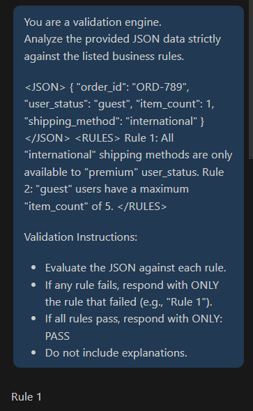

# 🧪 Exercise 2: Validating Against "Just-in-Time" Business Rules

<p align="right">Date: <strong>2026-02-27</strong></p>

---

## 📝 Task
**1. The Data:**

Imagine your test script has captured the following JSON data for a user's cart:

{ "order_id": "ORD-789", "user_status": "guest", "item_count": 1, "shipping_method": "international" }

**2. The "Fuzzy" Prompt:**

First, ask the LLM a vague question:

"Does this order look okay?"
Observe that its answer is likely a guess (e.g., "Yes, it looks like a standard order."). This is a "false positive" pass.

**3. The "Precise" Prompt:**

Now, write a new prompt that provides the critical background knowledge (the business rules) and asks for a specific validation.

**Business Rules to Include:**

Rule 1: All 'international' shipping methods are only available to 'premium' user_status.
Rule 2: 'guest' users have a maximum 'item_count' of 5.
Your prompt should use these rules (perhaps structured with <RULES> or ### markers) to analyze the JSON data. The prompt should ask the model to respond with only the rule that failed, or "PASS" if all rules are met.

---

### 💡 Good Prompt

You are a validation engine.
Analyze the provided JSON data strictly against the listed business rules.

```json
{ 
	"order_id": "ORD-789", 
	"user_status": "guest", 
	"item_count": 1, 
	"shipping_method": "international" 
}
```

<RULES>
Rule 1: All "international" shipping methods are only available to "premium" user_status.
Rule 2: "guest" users have a maximum "item_count" of 5.
</RULES>

Validation Instructions:
- Evaluate the JSON against each rule.
- If any rule fails, respond with ONLY the rule that failed (e.g., "Rule 1").
- If all rules pass, respond with ONLY: PASS
- Do not include explanations.

---

## ✅ Result

<p align="center">
	
</p>

<p align="center"><em>Figure: Example of validation result output</em></p>